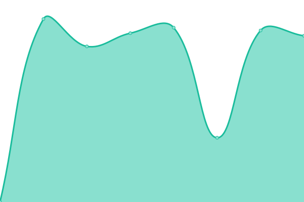
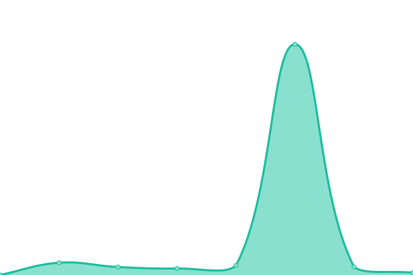

# [📈 Live Status](https://RevealUIStudio.github.io/status): <!--live status--> **🟧 Partial outage**

This repository contains the open-source uptime monitor and status page for [RevealUIStudio](https://RevealUIStudio.github.io/status), powered by [Upptime](https://github.com/upptime/upptime).

With [Upptime](https://upptime.js.org), you can get your own unlimited and free uptime monitor and status page, powered entirely by a GitHub repository. We use [Issues](https://github.com/RevealUIStudio/status/issues) as incident reports, [Actions](https://github.com/RevealUIStudio/status/actions) as uptime monitors, and [Pages](https://RevealUIStudio.github.io/status) for the status page.

<!--start: status pages-->
<!-- This summary is generated by Upptime (https://github.com/upptime/upptime) -->
<!-- Do not edit this manually, your changes will be overwritten -->
<!-- prettier-ignore -->
| URL | Status | History | Response Time | Uptime |
| --- | ------ | ------- | ------------- | ------ |
|  [Website](https://revealui.com) | 🟩 Up | [website.yml](https://github.com/RevealUIStudio/status/commits/HEAD/history/website.yml) | 

 568ms
     
 | 

<a href="https://RevealUIStudio.github.io/status/history/website">100.00%</a>
    

|  [API](https://api.revealui.com/health) | 🟩 Up | [api.yml](https://github.com/RevealUIStudio/status/commits/HEAD/history/api.yml) | 

 2997ms
     
 | 

<a href="https://RevealUIStudio.github.io/status/history/api">100.00%</a>
    

|  [Admin](https://admin.revealui.com) | 🟩 Up | [admin.yml](https://github.com/RevealUIStudio/status/commits/HEAD/history/admin.yml) | 

 4242ms
     
 | 

<a href="https://RevealUIStudio.github.io/status/history/admin">100.00%</a>
    

|  [License Service](https://api.revealui.com/api/license/verify) | 🟥 Down | [license-service.yml](https://github.com/RevealUIStudio/status/commits/HEAD/history/license-service.yml) | 

 199ms
     
 | 

<a href="https://RevealUIStudio.github.io/status/history/license-service">0.00%</a>
    

<!--end: status pages-->

[**Visit our status website →**](https://RevealUIStudio.github.io/status)

## 📄 License

- Powered by: [Upptime](https://github.com/upptime/upptime)
- Code: [MIT](./LICENSE) © [Anand Chowdhary](https://anandchowdhary.com), supported by [Pabio](https://pabio.com)
- Data in the `./history` directory: [Open Database License](https://opendatacommons.org/licenses/odbl/1-0/)
